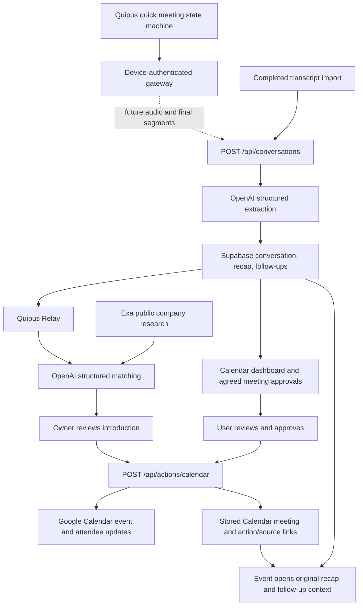

# Quipus architecture

## First-phase behavior

Quipus separates a conversation that already happened from a meeting agreed
for the future. A captured conversation holds the transcript, recap, and
follow-ups. A schedule follow-up becomes a dashboard approval. Explicit
approval creates a Google Calendar event; opening that event in Quipus shows
the original conversation's bullet recap and preparation tasks. Conversations
with an archived recording can also replay the original audio.

The intended wearable path is Agora transcription followed by OpenAI
understanding. This phase implements the completed-transcript boundary, the
downstream software, and a provider-independent Quipus device core. It does
not yet implement passive wearable audio transport or production provider
adapters.



The calendar provides month and agenda views. Conversations and People provide
other ways to reach the same context. Settings exposes the Google connection
and a route into the authenticated workspace. Quipus provides an interactive
simulator on the public sample and pairing, revocation, and telemetry in live
mode.

## Provider and application boundaries

| Boundary | Implementation | Current behavior |
| --- | --- | --- |
| Quipus state machine | `lib/lantern-state.ts` | Enforces consent, recording, pause/reconnect, status-report, and pending-approval transitions without provider calls. |
| Device identity | `lib/lantern-device-auth.ts`, migration 004 | Claims an expiring one-time code and validates a revocable per-device secret whose digest is stored server-side. |
| Device controls and consent | Centre-button firmware state machine, `/api/device/v1/command`, `/api/device/v1/speak`, firmware 0.3.1 | Keeps idle silent; short press opens server-bound spoken yes/no consent, a recording stops from the centre button, long press while ready plays the actual daily status report, and external invitations remain approval-only in the dashboard. |
| Device sessions | `/api/device/v1/sessions` and `/api/device/v1/sessions/[id]/events` | Stores versioned, idempotent state transitions and rejects stale events. |
| Device telemetry | `/api/device/v1/heartbeat`, `/api/devices` | Reports device state, firmware, battery, network, heap, and last error to the owner dashboard. |
| Completed transcripts | `lib/workspace/model.ts`, `app/api/conversations/route.ts` | Validates finalized, ordered segments and conversation timing; processes synchronously with OpenAI. |
| Understanding | `lib/providers/openai-extraction.ts` | Calls the OpenAI Responses API with strict JSON schema and validates the response and schedule evidence. |
| Existing capture-provider selection | `lib/providers/meeting-extraction.ts` | Uses OpenAI when configured, otherwise Qwen, for recording and legacy hardware processing. |
| Audio transcription | `lib/providers/transcription.ts` | Uses OpenAI diarization when configured, otherwise ElevenLabs or Groq. |
| Original-audio replay | Conversation brief, `recordingId`, and `recordingUrl` | Plays the private archived recording; transcript-only conversations have no replay audio. |
| Cross-conversation matching | `lib/providers/openai-relay.ts`, `/api/relay/matches` | Sends a bounded evidence DTO without contact emails to OpenAI Responses, requires strict structured output, and rejects unknown identities, non-exact evidence, duplicate pairs, and scores below 70. |
| Public company context | `lib/providers/exa.ts` | Optionally searches Exa using company names only; provider failure leaves matching available without public sources. |
| Relay persistence | `lib/relay-store.ts`, migration 006 | Stores user-scoped proposal snapshots and preserves dismissed or scheduled state across repeated model runs. |
| Relay execution | `/api/actions/calendar` | Revalidates the saved pair, exact attendee emails, source conversation, and explicit approval before Calendar execution marks the proposal scheduled. |
| Persistence | `lib/persistence.ts`, `lib/meetings-store.ts` | Writes the existing Supabase model and reconstructs the dashboard's conversation/event relationships. |
| Approval model | `lib/workspace/model.ts` | Derives approvals from schedule follow-ups and validates required scheduling details. |
| Google execution | `app/api/actions/calendar/route.ts`, `lib/providers/google-calendar.ts` | Requires explicit approval, resolves source ownership, records the action, and creates the Calendar event. |
| Sample preview | `lib/workspace/sample.ts`, `approveSample` | Uses fictional data and local browser state; has no provider-execution dependency. |
| Dashboard state | `components/workspace/useWorkspace.ts` | Selects sample or live adapters; live state is loaded from `/api/meetings`. |

The completed-transcript endpoint uses the shared OpenAI-first extraction
selector and does not invoke an ASR provider. Qwen remains a compatibility
fallback only when OpenAI is not configured. A configured OpenAI error
surfaces to the caller instead of silently sending the transcript to another
provider.

The browser recorder still joins Agora, publishes the microphone, and creates
a local recording. On Stop, it uploads that file for transcription. The
original hardware session routes still start a speaking Agora Conversational
AI agent, receive its transcript, and extract after completion. Those routes
are legacy behavior; the passive wearable should later feed normalized final
segments into the new boundary through authenticated device transport.

## Quipus Relay

Relay is the net-new hackathon agent layer. It treats the event as an essential
place: conversations captured there become a temporary relationship graph, and
the agent looks for a stated need in one conversation that a different person
can concretely help with. The existing wearable, transcript, OpenAI brief, and
Calendar components are inputs and execution tools; cross-conversation matching
and the introduction queue are the new core interaction.

`POST /api/relay/matches` accepts only optional event and venue labels from the
authenticated browser. It reloads the owner's conversations on the server,
selects up to twelve recent ready records, and constructs a bounded DTO of IDs,
names, company/role, needs, offers, and transcript or memory evidence. Email
addresses, audio URLs, recordings, follow-ups, and unrelated meeting fields are
excluded from the OpenAI request. The request uses the Responses API with
`store: false` and a strict JSON schema.

OpenAI can return at most four proposals. Quipus then verifies that both
conversation and contact IDs exist, the parties differ, both evidence strings
exactly match supplied evidence after whitespace normalization, the pair is
unique, and the score is at least 70. Provider output cannot create an invite.
The validated result becomes an owner-scoped `relay_matches` row.

If `EXA_API_KEY` is present, the server sends up to four unique company names to
Exa and attaches validated HTTP(S) sources for the involved companies. No
transcript or personal contact detail is part of an Exa request. Exa failure is
non-fatal because public research supports a match rather than proving what a
person said.

The final dialog is the authority boundary. A live Calendar request includes
the Relay proposal ID. The server reloads that owner-scoped proposal and checks
the exact two emails and source conversation before calling Google. A dismissed
proposal cannot execute. Successful or idempotently recovered Calendar
execution marks the proposal scheduled; the browser cannot mark it scheduled
through the generic Relay status route.

## Quipus device core

The standalone device never receives a browser cookie. An owner creates a
pairing code through `POST /api/devices/pairing`; the device claims it through
`POST /api/device/v1/claim`. The claim returns a device UUID and secret once.
Subsequent requests use:

```http
Authorization: Device <device-uuid>.<device-secret>
```

`proxy.ts` permits only the explicit device protocol paths to reach their own
authentication layer. The claim route is protected by a short-lived one-time
code. Heartbeats and session routes validate the device credential and reject
revoked devices. Owner routes continue to use the normal workspace login.

The server is authoritative for time and transition order. Every session event
has a UUID and expected state version. Migration 004 applies a transition in a
database function that checks the stored version, writes the audit event, and
updates device state in one transaction. Retrying an acknowledged event UUID
returns the stored result. A new event with an old version receives `409`.

Quick mode starts in `awaiting_recording_consent`. The exact prompt ID must be
accepted within 30 seconds before state can enter `recording`. Connection loss
then permits at most 30 seconds of modeled retry buffering. Stopping moves
through `finalising`, `processing`, and `report_ready`. The device uploads the
Agora caption batch and private WAV, then announces dashboard readiness only
after synchronous processing succeeds.

Status mode moves through oath listening and the daily report. Confirming a
read-back proposal produces `pending_dashboard_approval`. The state machine has
no transition that sends an invitation from voice confirmation. Google
execution continues to require the existing authenticated dashboard approval.

The Quipus dashboard uses the same state machine locally as an executable
prototype. This validates interaction rules but does not represent connected
hardware, captured audio, OpenAI extraction accuracy, or provider delivery.

## Completed-transcript API

`POST /api/conversations` is an owner-authenticated JSON endpoint. It requires
Supabase and `OPENAI_API_KEY`, and processes a completed conversation within the
request. There is no background job or streamed partial response.

Example request body:

```json
{
  "version": 1,
  "sourceReference": "import:client-discussion-001",
  "source": "transcript_import",
  "title": "Client onboarding discussion",
  "startedAt": "2026-09-06T14:00:00+08:00",
  "endedAt": "2026-09-06T15:10:00+08:00",
  "timeZone": "Asia/Kuala_Lumpur",
  "segments": [
    {
      "id": "turn-1",
      "speaker": "Speaker 1",
      "text": "Let's review the pilot on Thursday, 10 September at 10 am for 30 minutes.",
      "startSeconds": 4020,
      "endSeconds": 4028
    },
    {
      "id": "turn-2",
      "speaker": "Speaker 2",
      "text": "Yes, agreed: Thursday, 10 September at 10 am for 30 minutes. Send the invite to client@example.com.",
      "startSeconds": 4029,
      "endSeconds": 4040
    }
  ]
}
```

The current contract requires:

- `version: 1`, a stable `sourceReference` of at most 120 characters, and
  `source` equal to `agora` or `transcript_import`.
- A title, explicit-offset timestamps with the end after the start, and
  `timeZone: "Asia/Kuala_Lumpur"`. Other timezones are not currently accepted.
- Between 1 and 10,000 final segments, each with a unique ID, speaker label,
  nonempty text, and nonnegative start/end seconds. Segments must be ordered
  by start time and fit within the conversation's duration.
- Unknown speakers represented honestly, for example `Speaker 1`. A wearable
  microphone or RTC user ID does not by itself identify each person nearby.

The route limits the UTF-8 JSON body to 2,000,000 bytes. Segment text is
separately limited to 50,000 characters. Segment IDs are retained in the
transcript, although the current extraction evidence check uses quotes rather
than references to those IDs. The endpoint currently requests English derived
output while preserving original transcript text.

The server hashes `sourceReference` into a stable
`conversation:<sha256>` client reference scoped by workspace lookup. A unique
owner/reference constraint claims a new import, and a conditional update
claims a retry only when the previous attempt is marked failed. The responses
are:

| Outcome | Response |
| --- | --- |
| New successful import | `201` with `meeting`, `persisted`, `conversationId`, and `duplicate: false`. |
| Already ready | `200` with `persisted`, `conversationId`, and `duplicate: true`; no second extraction. |
| Import already claimed | `409`; refresh before retrying. |
| Invalid input or extracted data | `400`. |
| Missing storage | `503`. |
| Processing/provider failure | Error response; a claimed processing record is marked failed when the catch handler runs. |

Persistence keeps the meeting in `processing` until derived records have been
saved, then changes it to `ready`. Reload `/api/meetings` to obtain the complete
dashboard read model. A process crash can leave a claim in `processing` and
requires operator recovery; there is no lease expiry or automatic retry queue.
Database writes remain multiple operations rather than one transaction.

References beginning with `sample:` are rejected. Do not reuse a source
reference for a different or edited conversation: the ready-record shortcut
does not compare transcript contents. This endpoint is an import contract,
not a general-purpose conversation editor or a device-authentication bypass.

## Extraction and review

OpenAI returns the existing `MeetingExtraction` shape: `insight`, `participants`,
and `followUps`. The insight includes compact `keyPoints`, concerns, promises,
and commitments. A schedule follow-up additionally carries:

```text
schedule: {
  agreement: "agreed" | "tentative"
  startAt: RFC3339 timestamp | null
  durationMinutes: integer from 5 to 480 | null
  attendees: email[]
  location: string | null
  evidence: string | null
}
```

The OpenAI prompt instructs the model to apply later corrections, resolve
relative dates against the conversation start, and exclude tentative or
rejected arrangements from schedule follow-ups. Local validation requires
every returned schedule follow-up to be agreed and have evidence matching a
contiguous quote within one transcript segment after whitespace normalization.
That check verifies the quote's presence, not the semantic certainty of an
agreement. The person reviewing the approval remains responsible for the
event's details.

Missing date/time, duration, or attendee email opens the review dialog.
Approvals may be completed, dismissed, or restored. Non-schedule follow-ups
remain checklist tasks in the conversation brief. Historical Qwen schedule
follow-ups without structured details can still appear for manual completion;
they do not gain verified evidence merely by being displayed.

The live approval adapter submits `approved: true`, the reviewed title, start,
duration, attendee emails, optional location, source meeting ID, follow-up ID,
and an approval-based idempotency key to `/api/actions/calendar`. The endpoint
checks source ownership and approval linkage, rejects sample references and
dismissed approvals, verifies Google authorization, and records the action
before creating the event with attendee updates enabled. The original private recap is not
automatically copied into the invitation by this dashboard flow.

The action path normalizes start timestamps and uses deterministic Google
event IDs and saved action records for retries. Submitted details, including
location, are restored from the action payload when a pending approval is
reloaded. Migration 003 also restricts each follow-up to one Calendar action;
a subsequent submission with different details is rejected rather than treated
as another approval. Database writes and the Google request are not a single
transaction. Failures are reported and require retry/reconciliation; there is
no autonomous job runner providing an end-to-end delivery guarantee.
Legacy action keys and ambiguous results recovered after the scheduled start
can require operator reconciliation; this is not an exactly-once guarantee.

An availability API exists at `/api/calendar/availability`. The new approval
flow does not invoke it automatically, so approval does not imply that a
conflict or attendee availability check has passed.

## Data model and event context

The first phase extends existing tables rather than introducing a separate
conversation database.

| Table | Role |
| --- | --- |
| `meetings` | Captured conversations and upcoming Calendar meetings; `source`, `recording_id`, and `calendar_event_id` distinguish them. |
| `recordings` | Capture metadata, provider metadata, and optional private storage path; transcript imports have no audio file. |
| `transcripts` | Transcript text and timestamped segments associated with a recording. |
| `meeting_insights` | Recap fields, including bullet key points and concerns. |
| `contacts`, `meeting_contacts` | People and their relationships to conversations/events. |
| `commitments` | Extracted promises and ownership. |
| `follow_ups` | Tasks and schedule approvals; migration 003 adds `schedule_details` JSONB and the `dismissed` status. |
| `actions` | Approval/execution record; `meeting_id` links the source conversation, `follow_up_id` links the approval, and `external_id` holds the Google event ID. |
| `provider_connections` | Encrypted Google OAuth credentials for the workspace owner. |
| `relay_matches` | OpenAI-generated introduction proposals, evidence snapshot, pair hash, model, and approval state; migration 006 scopes every row to its owner. |

Calendar creation saves a separate upcoming meeting with a
`calendar:<event-id>` client reference. On reload, `loadMeetings()` matches
Calendar actions with an `external_id` to those events and exposes
`sourceConversationId` and `sourceApprovalId` in the frontend read model.
These are derived links, not
new columns on `meetings`. `ConversationPanel` follows that relationship to
show the captured conversation's summary, transcript, and tasks beneath the
future event's date and time.

Keep the action record and original conversation intact when extending this
model. Legacy or manually created events without a linked Calendar action
show an empty recap state rather than an invented brief.

## Original-audio replay

Replay uses the original uploaded or browser-captured conversation, not a
text-to-speech recreation. The private Supabase `recordings` bucket holds the
audio object; `recordings.storage_path` identifies that object, and the related
`transcripts` row holds its text and timestamps. The source conversation's
`recordingId` and temporary `recordingUrl` supply playback from its brief or a
linked Calendar event. Playback does not require another OpenAI or ASR request.

The dedicated Replay section provides a seekable player, playback speed,
15-second skips, and timestamped transcript entries that seek within the
recording. Transcript `startSeconds` and `endSeconds` must refer to the same
audio timeline. The UI can navigate recorded timestamps; it cannot repair
misaligned or absent timing data.

Playback pauses when leaving Replay. The conversation panel remembers the
position and speed while the dashboard stays open, including when entering
through its linked Calendar event. This progress is held in memory and resets
on a page reload; the original audio is not downloaded into browser storage.

The authenticated refresh boundary is
`GET /api/recordings/[id]/playback`. It verifies the configured owner's
recording UUID and owner-prefixed storage path, then returns
`{ "url": "...", "expiresAt": "..." }` with a 7,200-second signed-URL
lifetime and `Cache-Control: no-store`. Invalid IDs return `400`; absent or
unowned audio returns `404`; unavailable configuration returns `503`; lookup
or signing failures return `502`. Audio delivery goes directly from storage
to the browser rather than through the Next.js route. URL refresh grants
access to an existing object; it does not
extend the recording's retention or create missing audio.

Transcript imports currently create recording metadata without an audio
object. Sample conversations and the legacy hardware transcript-completion
path also have no archived original audio. Those cases show a no-audio state
while keeping the recap and transcript available. A provider label such as
`agora` is not evidence that playable audio exists.

For future passive wearable capture, the gateway must archive the actual
microphone audio as a complete recording or durable chunks that can be
assembled for replay. Preserve each chunk's sequence, capture-clock offset,
duration, and any gaps; align final transcript timestamps to the resulting
recording. Attach the archive through verified owner-owned recording metadata
and link it to the same conversation. The current transcript-import endpoint
does not accept an audio attachment. STT output alone cannot recreate the
original voices or conversation audio, and this phase does not connect that
hardware capture path.

The next capture phase should keep playback delivery in private object
storage, use seekable encoded recordings, and load audio on demand rather than
buffering an hour-long recording in the dashboard. Define configurable audio
retention and deletion together with the associated recording metadata;
retaining a recap after deleting its audio should leave an explicit no-audio
state. Automatic retention and chunk assembly are not implemented here.

## Sample and live adapters

The public `/` route loads fictional records whose IDs start with `sample:`.
The preview stores changes under `lantern:sample-workspace:v1` in browser
storage. Sample approval creates a local calendar entry linked to its sample
conversation; it does not call OpenAI, Agora, Google, or live mutation endpoints.
Reset replaces only the sample workspace. Browser-storage failures leave the
preview usable in memory.

Live mode loads Supabase data and invokes authenticated application APIs.
It is available only from `/dashboard` after Google authentication. The public
sample never performs the live-data fetch, and sample state is not merged into
live state. The sample preview is not evidence that live providers or a wearable
have been connected.

## Setup and remaining work

Apply migrations 001 through 006 before enabling the complete Quipus and Relay
flow. Set
the Supabase values and owner identity, then the Agora Speech-to-Text and OpenAI
credentials. Google execution additionally needs OAuth client configuration,
a registered `/api/google/callback`, `ACTION_APPROVAL_SECRET`, and a connected
Google account. [README.md](README.md) contains the setup steps. Browser audio
uploads and missing Agora captions use OpenAI transcription. Relay uses the
same `OPENAI_API_KEY`; `EXA_API_KEY` is optional. Legacy provider and messaging
adapters have no production environment dependency.

The following are deliberately deferred:

- Hour-plus wearable replay with an encoded on-device format, provider token
  renewal, cross-reboot upload resumption, incremental durable transcript
  storage, and explicit gap records. Quipus V2 now writes a complete PCM WAV
  to FAT32 microSD and uploads it in idempotent 512 KB chunks; the current 25 MB
  WAV contract covers about 13 minutes 39 seconds.
- A field-quality custom wake-word model. The prototype deliberately uses the
  centre button while idle; its long-press daily Status Report flow is active.
  All external actions still require approval in the dashboard.
- A durable processing queue, recoverable background extraction, and complete
  failure reconciliation across providers, including abandoned import claims.
- Validated speaker attribution and Malaysian mixed-language accuracy on real
  wearable recordings. The new adapter does not establish those results.
- Multiuser authentication and tenant ownership throughout API and persistence
  code. Current storage resolves the configured demo owner; `public` demo
  access bypasses login and does not provide multiuser isolation.
- Two-way Google Calendar synchronization, watch/webhook handling, importing
  unrelated events, and reconciling edits/deletions made in Google. The
  dashboard currently uses Quipus's own stored meeting/event records.
- Automatic conflict checks and richer handling of rescheduled or cancelled
  meetings. Explicit approval remains a requirement before sending invitations.
