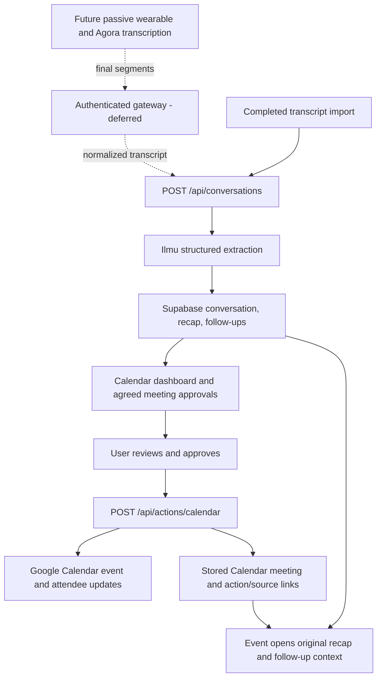

# Roxanne architecture

## First-phase behavior

Roxanne separates a conversation that already happened from a meeting agreed
for the future. A captured conversation holds the transcript, recap, and
follow-ups. A schedule follow-up becomes a dashboard approval. Explicit
approval creates a Google Calendar event; opening that event in Roxanne shows
the original conversation's bullet recap and preparation tasks.

The intended wearable path is Agora transcription followed by Ilmu
understanding. This phase implements the completed-transcript boundary and
the downstream software. It does not yet implement a passive wearable
transcription service or delivery gateway.



The calendar provides month and agenda views. Conversations and People provide
other ways to reach the same context. Settings exposes the Google connection
and sample/live workspace switch. The wearable connection state is a
placeholder for future pairing, not a live device monitor.

## Provider and application boundaries

| Boundary | Implementation | Current behavior |
| --- | --- | --- |
| Completed transcripts | `lib/workspace/model.ts`, `app/api/conversations/route.ts` | Validates finalized, ordered segments and conversation timing; processes synchronously with Ilmu. |
| Understanding | `lib/providers/ilmu.ts` | Calls Ilmu Chat Completions with strict JSON schema and validates the response and schedule evidence. |
| Existing capture-provider selection | `lib/providers/meeting-extraction.ts` | Uses Ilmu when configured, otherwise Qwen, for recording and legacy hardware processing. |
| Audio transcription | `lib/providers/transcription.ts` | Uses ElevenLabs when configured, otherwise Groq; separate from Ilmu understanding. |
| Persistence | `lib/persistence.ts`, `lib/meetings-store.ts` | Writes the existing Supabase model and reconstructs the dashboard's conversation/event relationships. |
| Approval model | `lib/workspace/model.ts` | Derives approvals from schedule follow-ups and validates required scheduling details. |
| Google execution | `app/api/actions/calendar/route.ts`, `lib/providers/google-calendar.ts` | Requires explicit approval, resolves source ownership, records the action, and creates the Calendar event. |
| Sample preview | `lib/workspace/sample.ts`, `approveSample` | Uses fictional data and local browser state; has no provider-execution dependency. |
| Dashboard state | `components/workspace/useWorkspace.ts` | Selects sample or live adapters; live state is loaded from `/api/meetings`. |

The completed-transcript endpoint calls Ilmu directly. It never selects Qwen
or an ASR provider. The older recording-processing paths retain their provider
selector so existing integrations remain usable. A configured Ilmu error
surfaces to the caller instead of silently sending the transcript to another
provider.

The browser recorder still joins Agora, publishes the microphone, and creates
a local recording. On Stop, it uploads that file for transcription. The
original hardware session routes still start a speaking Agora Conversational
AI agent, receive its transcript, and extract after completion. Those routes
are legacy behavior; the passive wearable should later feed normalized final
segments into the new boundary through authenticated device transport.

## Completed-transcript API

`POST /api/conversations` is an owner-authenticated JSON endpoint. It requires
Supabase and `ILMU_API_KEY`, and processes a completed conversation within the
request. There is no background job or streamed partial response.

Example request body:

```json
{
  "version": 1,
  "sourceReference": "import:client-discussion-001",
  "source": "transcript_import",
  "title": "Client onboarding discussion",
  "startedAt": "2026-09-06T14:00:00+08:00",
  "endedAt": "2026-09-06T15:10:00+08:00",
  "timeZone": "Asia/Kuala_Lumpur",
  "segments": [
    {
      "id": "turn-1",
      "speaker": "Speaker 1",
      "text": "Let's review the pilot on Thursday, 10 September at 10 am for 30 minutes.",
      "startSeconds": 4020,
      "endSeconds": 4028
    },
    {
      "id": "turn-2",
      "speaker": "Speaker 2",
      "text": "Yes, agreed: Thursday, 10 September at 10 am for 30 minutes. Send the invite to client@example.com.",
      "startSeconds": 4029,
      "endSeconds": 4040
    }
  ]
}
```

The current contract requires:

- `version: 1`, a stable `sourceReference` of at most 120 characters, and
  `source` equal to `agora` or `transcript_import`.
- A title, explicit-offset timestamps with the end after the start, and
  `timeZone: "Asia/Kuala_Lumpur"`. Other timezones are not currently accepted.
- Between 1 and 10,000 final segments, each with a unique ID, speaker label,
  nonempty text, and nonnegative start/end seconds. Segments must be ordered
  by start time and fit within the conversation's duration.
- Unknown speakers represented honestly, for example `Speaker 1`. A wearable
  microphone or RTC user ID does not by itself identify each person nearby.

The route limits the UTF-8 JSON body to 2,000,000 bytes. Segment text is
separately limited to 50,000 characters. Segment IDs are retained in the
transcript, although the current extraction evidence check uses quotes rather
than references to those IDs. The endpoint currently requests English derived
output while preserving original transcript text.

The server hashes `sourceReference` into a stable
`conversation:<sha256>` client reference scoped by workspace lookup. A unique
owner/reference constraint claims a new import, and a conditional update
claims a retry only when the previous attempt is marked failed. The responses
are:

| Outcome | Response |
| --- | --- |
| New successful import | `201` with `meeting`, `persisted`, `conversationId`, and `duplicate: false`. |
| Already ready | `200` with `persisted`, `conversationId`, and `duplicate: true`; no second extraction. |
| Import already claimed | `409`; refresh before retrying. |
| Invalid input or extracted data | `400`. |
| Missing storage | `503`. |
| Processing/provider failure | Error response; a claimed processing record is marked failed when the catch handler runs. |

Persistence keeps the meeting in `processing` until derived records have been
saved, then changes it to `ready`. Reload `/api/meetings` to obtain the complete
dashboard read model. A process crash can leave a claim in `processing` and
requires operator recovery; there is no lease expiry or automatic retry queue.
Database writes remain multiple operations rather than one transaction.

References beginning with `sample:` are rejected. Do not reuse a source
reference for a different or edited conversation: the ready-record shortcut
does not compare transcript contents. This endpoint is an import contract,
not a general-purpose conversation editor or a device-authentication bypass.

## Extraction and review

Ilmu returns the existing `MeetingExtraction` shape: `insight`, `participants`,
and `followUps`. The insight includes compact `keyPoints`, concerns, promises,
and commitments. A schedule follow-up additionally carries:

```text
schedule: {
  agreement: "agreed" | "tentative"
  startAt: RFC3339 timestamp | null
  durationMinutes: integer from 5 to 480 | null
  attendees: email[]
  location: string | null
  evidence: string | null
}
```

The Ilmu prompt instructs the model to apply later corrections, resolve
relative dates against the conversation start, and exclude tentative or
rejected arrangements from schedule follow-ups. Local validation requires
every returned schedule follow-up to be agreed and have evidence matching a
contiguous quote within one transcript segment after whitespace normalization.
That check verifies the quote's presence, not the semantic certainty of an
agreement. The person reviewing the approval remains responsible for the
event's details.

Missing date/time, duration, or attendee email opens the review dialog.
Approvals may be completed, dismissed, or restored. Non-schedule follow-ups
remain checklist tasks in the conversation brief. Historical Qwen schedule
follow-ups without structured details can still appear for manual completion;
they do not gain verified evidence merely by being displayed.

The live approval adapter submits `approved: true`, the reviewed title, start,
duration, attendee emails, optional location, source meeting ID, follow-up ID,
and an approval-based idempotency key to `/api/actions/calendar`. The endpoint
checks source ownership and approval linkage, rejects sample references and
dismissed approvals, verifies Google authorization, and records the action
before creating the event with attendee updates enabled. The original private recap is not
automatically copied into the invitation by this dashboard flow.

The action path normalizes start timestamps and uses deterministic Google
event IDs and saved action records for retries. Submitted details, including
location, are restored from the action payload when a pending approval is
reloaded. Migration 003 also restricts each follow-up to one Calendar action;
a subsequent submission with different details is rejected rather than treated
as another approval. Database writes and the Google request are not a single
transaction. Failures are reported and require retry/reconciliation; there is
no autonomous job runner providing an end-to-end delivery guarantee.
Legacy action keys and ambiguous results recovered after the scheduled start
can require operator reconciliation; this is not an exactly-once guarantee.

An availability API exists at `/api/calendar/availability`. The new approval
flow does not invoke it automatically, so approval does not imply that a
conflict or attendee availability check has passed.

## Data model and event context

The first phase extends existing tables rather than introducing a separate
conversation database.

| Table | Role |
| --- | --- |
| `meetings` | Captured conversations and upcoming Calendar meetings; `source`, `recording_id`, and `calendar_event_id` distinguish them. |
| `recordings` | Capture metadata, provider metadata, and optional private storage path; transcript imports have no audio file. |
| `transcripts` | Transcript text and timestamped segments associated with a recording. |
| `meeting_insights` | Recap fields, including bullet key points and concerns. |
| `contacts`, `meeting_contacts` | People and their relationships to conversations/events. |
| `commitments` | Extracted promises and ownership. |
| `follow_ups` | Tasks and schedule approvals; migration 003 adds `schedule_details` JSONB and the `dismissed` status. |
| `actions` | Approval/execution record; `meeting_id` links the source conversation, `follow_up_id` links the approval, and `external_id` holds the Google event ID. |
| `provider_connections` | Encrypted Google OAuth credentials for the workspace owner. |

Calendar creation saves a separate upcoming meeting with a
`calendar:<event-id>` client reference. On reload, `loadMeetings()` matches
Calendar actions with an `external_id` to those events and exposes
`sourceConversationId` and `sourceApprovalId` in the frontend read model.
These are derived links, not
new columns on `meetings`. `ConversationPanel` follows that relationship to
show the captured conversation's summary, transcript, and tasks beneath the
future event's date and time.

Keep the action record and original conversation intact when extending this
model. Legacy or manually created events without a linked Calendar action
show an empty recap state rather than an invented brief.

## Sample and live adapters

`/dashboard?mode=sample` loads fictional records whose IDs start with `sample:`.
The preview stores changes under `roxanne:sample-workspace:v1` in browser
storage. Sample approval creates a local calendar entry linked to its sample
conversation; it does not call Ilmu, Agora, Google, or live mutation endpoints.
Reset replaces only the sample workspace. Browser-storage failures leave the
preview usable in memory.

Live mode loads Supabase data and invokes authenticated application APIs.
Switching modes clears the currently displayed dataset; sample state is not
merged into live state. The explicit sample URL skips the live-data fetch in
the workspace hook. App authentication still runs according to deployment
configuration. The sample preview is not evidence that live providers or a
wearable have been connected.

## Setup and remaining work

Apply migrations 001, 002, and 003 before enabling structured approvals. Set
the Supabase values and owner identity, then `ILMU_API_KEY` and optionally
`ILMU_MODEL`. Google execution additionally needs OAuth client configuration,
a registered `/api/google/callback`, `ACTION_APPROVAL_SECRET`, and a connected
Google account. [README.md](README.md) contains the setup steps. Audio uploads
also need ElevenLabs or Groq transcription; completed transcript imports do
not. Devin and WhatsApp are optional legacy paths outside this approval flow.

The following are deliberately deferred:

- Passive wearable Agora transcription and a gateway that delivers the
  normalized contract; the existing speaking-agent firmware is not this path.
- Device pairing and revocation, hour-plus token renewal, offline capture,
  reconnect/resume, chunk acknowledgements, bounded buffers, and incremental
  durable transcript storage.
- A durable processing queue, recoverable background extraction, and complete
  failure reconciliation across providers, including abandoned import claims.
- Validated speaker attribution and Malaysian mixed-language accuracy on real
  wearable recordings. The new adapter does not establish those results.
- Multiuser authentication and tenant ownership throughout API and persistence
  code. Current storage resolves the configured demo owner; `public` demo
  access bypasses login and does not provide multiuser isolation.
- Two-way Google Calendar synchronization, watch/webhook handling, importing
  unrelated events, and reconciling edits/deletions made in Google. The
  dashboard currently uses Roxanne's own stored meeting/event records.
- Automatic conflict checks and richer handling of rescheduled or cancelled
  meetings. Explicit approval remains a requirement before sending invitations.
