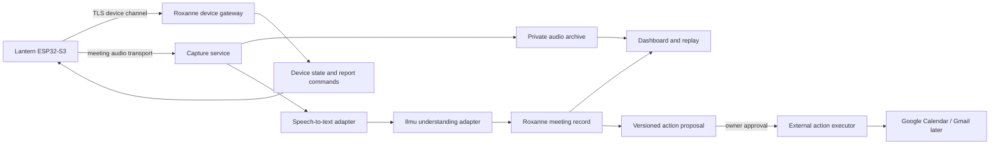

# Lantern product and system specification

**Version:** 0.2  
**Date:** 11 September 2026  
**Status:** Proposed for discussion before implementation  
**Primary user:** An individual business developer capturing client conversations and arranging follow-ups

## 1. Product contract

Lantern is a portable, voice-first capture device connected to Roxanne. It records a disclosed, consented business conversation, preserves the original audio, produces a transcript and evidence-linked summary, and prepares follow-up actions for approval.

The device has two modes:

1. **Quick meeting mode**
   - The owner wakes the device with the word "Ring" or the main button.
   - "We're talking now" begins a consent flow.
   - Recording starts only after the device asks for confirmation and hears a valid response in that prompt state.
   - "We're done" or a deliberate button action finalizes the recording.

2. **Status report mode**
   - "Ring, status report" opens the ritual.
   - The full oath is accepted as an activation ritual, not as authentication.
   - Lantern reads the day's meetings, key facts, commitments and pending actions from saved Roxanne records.
   - A proposed meeting or email is read back in full and placed in Roxanne for approval.
   - The report ends with "Status report complete. Lantern, Sector 2418 — Nathan Hor."

The ring image and oath establish the product's character. The dashboard login, device credential, consent state and versioned approval provide security and authorization.

### First product boundary

- One owner and one paired device.
- Phone-hotspot or ordinary 2.4 GHz Wi-Fi connectivity.
- English and Malaysian code-switching are product requirements; accuracy must be measured using real recordings.
- One active meeting at a time.
- Original audio, transcript, summary, action items and approvals remain linked.
- Google and Agora adapters are deferred until the device, capture contract and approval state machine work with test services.
- The ESP32-CAM is outside the core first release. It remains an optional future ring-recognition accessory.

## 2. Hardware audit

The repository targets `zhengchen-1.54tft-ml307`, built around an ESP32-S3. A
factory boot log has now confirmed ESP32-S3 revision 0.2 and 8 MB octal PSRAM.
The local firmware configuration identifies the module as N16R8, but its 16 MB
flash size still needs a ROM-loader `flash_id` check before flashing.

The ESP32-S3 itself provides a dual-core 240 MHz processor, 512 KB internal SRAM, 2.4 GHz 802.11 b/g/n Wi-Fi and Bluetooth LE. It is capable of audio I/O, display control, local state handling, buffering and lightweight wake-word processing. It is not the place to run the full speech-to-text and language model pipeline. See the [Espressif ESP32-S3 overview](https://www.espressif.com/en/products/socs/esp32-s3/).

| Component | Confirmed board support | Lantern use |
| --- | --- | --- |
| Processor | ESP32-S3 revision 0.2; local build expects N16R8 | Audio, UI, networking, state machine and device security |
| Display | 1.54-inch ST7789, 240 × 240, RGB565; factory boot initializes LVGL and the panel | Ring art, prompts, timer, connectivity, battery and error states |
| Microphone | Digital I²S, 16 kHz in the supported board configuration | Meeting capture and bounded command listening |
| Speaker path | I²S simplex output, 24 kHz upstream; current Roxanne firmware uses 8 kHz RTC output | Prompts and spoken status reports, silent during meetings |
| Controls | Main/boot, volume up and volume down | Wake, physical stop/pause fallback and volume |
| Wi-Fi | ESP32-S3 2.4 GHz Wi-Fi | Prototype transport through phone hotspot or known Wi-Fi |
| Cellular | ML307 UART path and upstream dual-network support | Later portable mode after modem and Malaysian carrier validation |
| Battery | Charge-state, battery ADC and temperature hooks exist upstream; factory log reports the power manager active | Battery status, low-battery warning and shutdown policy |
| Camera | None on this board | Not needed for Quick or Status Report modes |
| Bulk storage | No SD-card or hour-long audio store is established | Audio must stream; PSRAM is only a short retry buffer |

### Board pin map

| Function | GPIO |
| --- | ---: |
| Main/boot button | 0 |
| Volume up | 10 |
| Volume down | 39 |
| Microphone WS | 4 |
| Microphone SCK | 5 |
| Microphone data | 6 |
| Speaker data | 7 |
| Speaker BCLK | 15 |
| Speaker LRCK | 16 |
| Display SDA/MOSI | 41 |
| Display SCL/clock | 42 |
| Display reset | 45 |
| Display DC | 40 |
| Display CS | 21 |
| Display backlight | 20 |
| ML307 RX | 11 |
| ML307 TX | 12 |
| Charging state | 9 in the upstream power manager |

The board mapping is supported by the upstream [configuration](https://github.com/78/xiaozhi-esp32/blob/main/main/boards/zhengchen/1.54tft-ml307/config.h) and [board implementation](https://github.com/78/xiaozhi-esp32/blob/main/main/boards/zhengchen/1.54tft-ml307/zhengchen-1.54tft-ml307.cc).

### Current connection result

On 12 September 2026, Windows exposed `USB-SERIAL CH340K (COM5)` with USB VID
`1A86`, PID `7522`, and driver `CH341SER_A64`. A read-only reset captured the
factory boot log and confirmed that COM5 belongs to the ZHENGCHEN ESP32-S3.
The log reports factory project `xiaozhi` 2.4.0, board SKU
`zhengchen-1.54tft-ml307-agora-sg3`, ESP-IDF 5.5.2, chip revision 0.2, and 8 MB
octal PSRAM. It also initializes the display, simplex audio, battery manager,
buttons, and Wi-Fi.

The installed Espressif Python environment contains esptool 4.12.0. Automatic
ROM-loader entry did not succeed, and the board was returned to its factory
firmware after the attempt. Holding the main GPIO0 button during reconnect
successfully entered the ROM loader. Esptool then confirmed 16 MB quad flash at
3.3 V and read the complete flash into the ignored `hardware/backups` folder.
The saved 16,777,216-byte image passed esptool digest verification, has a local
SHA-256 checksum file, and the board subsequently booted the factory Xiaozhi
firmware again. No flash content has been written or erased.

The factory partition table is also preserved. It contains 16 KB NVS, 8 KB OTA
metadata, 4 KB PHY data, two 4,032 KB OTA application slots, and an 8 MB SPIFFS
assets partition.

### Hardware facts still to verify on the bench

- Exact printed ESP32-S3 module marking. The chip, 16 MB flash and 8 MB PSRAM are confirmed.
- Exact ML307 sub-model and supported Malaysian LTE bands.
- Whether the visible USB socket carries data, charging, modem USB or a combination.
- Battery capacity, charge-controller behavior and real continuous-recording runtime.
- Microphone level, speaker loudness, echo and noise performance in a client-meeting setting.
- Whether any usable external flash or SD interface exists beyond the documented 16 MB device flash.

### Toolchain constraint

The local Roxanne firmware is pinned to ESP-IDF 5.2.3 to match its current Agora embedded SDK. The current upstream Xiaozhi board project requires ESP-IDF 6.1. Board pin definitions remain useful, but its newest display, cellular and power code cannot be assumed to compile unchanged in the Roxanne toolchain. Phase 1 should keep the known Agora-compatible toolchain and port only the required peripheral drivers. An ESP-IDF upgrade should happen only after the supported Agora version is checked and the audio path has regression tests. See the current [upstream project requirements](https://github.com/78/xiaozhi-esp32#development-environment).

## 3. System architecture



### Device responsibilities

- Capture one 16 kHz mono microphone stream.
- Run the local state machine and a bounded wake/command detector.
- Encode or frame audio and transmit ordered chunks or RTC frames.
- Maintain a short PSRAM retry buffer with explicit gap reporting.
- Render the screen and operate the speaker and buttons.
- Maintain time synchronization, battery telemetry and connection status.
- Authenticate to Roxanne with a revocable per-device credential.
- Accept only signed configuration and firmware updates.

### Backend responsibilities

- Pair the device to an authenticated owner.
- Issue short-lived session credentials and enforce state transitions.
- Archive the original audio independently of transcript generation.
- Track ordered chunks, acknowledgements, capture offsets and gaps.
- Normalize final transcript segments and call Ilmu through a provider adapter.
- Save summaries, contacts, follow-ups and evidence links.
- Create immutable versions of proposed external actions.
- Execute an action only after the required approval and record the provider result.
- Push report data, processing state and errors to the dashboard and device.

### Dashboard responsibilities

- Pair, rename, revoke and inspect devices.
- Show battery, network, firmware, last-seen time and current capture state.
- Display a calendar and a dedicated approvals queue.
- Open a conversation to its summary, commitments, original audio and timestamped transcript.
- Allow corrections without erasing the original transcript evidence.
- Approve, edit, dismiss or retry a meeting invitation or follow-up email.
- Connect Google later through server-side OAuth. Google credentials never reach the ESP32.

## 4. Connectivity design

### Prototype

Use a phone hotspot in 2.4 GHz compatibility mode. The device should support a provisioning flow instead of compiling the hotspot password into firmware. A dashboard-generated pairing code can bind the device after it reaches the internet.

### Portable pilot

Use the ML307 cellular module only after identifying its exact variant, confirming its LTE bands with a Malaysian carrier and measuring sustained audio traffic and battery impact. The upstream board source can switch between Wi-Fi and cellular, but it reboots to change network type; seamless failover is not yet established.

### Loss of connection

The device cannot safely store an hour of meeting audio in its current flash layout. One hour of 16-bit, 16 kHz mono PCM is about 115 MB. Opus at 16–24 kbit/s is about 7–11 MB before transport overhead, still too large to reserve safely alongside firmware on a 16 MB device.

Therefore:

- Keep a 10–30 second retry ring buffer in PSRAM.
- Upload or publish continuously.
- Preserve monotonic capture offsets and chunk sequence numbers.
- Retry acknowledged chunks idempotently.
- Mark unrecoverable gaps in the meeting record and tell the user.
- Never report an incomplete recording as complete.
- A future offline requirement needs external storage or a phone gateway.

## 5. Audio design

Meeting capture and voice interaction are separate paths over the same microphone:

1. **Archive path:** the complete, consented conversation, transmitted continuously and retained as the original replay source.
2. **Command path:** a local wake detector watches for "Ring" or a button press. Only the bounded command that follows is sent for recognition.
3. **Report path:** the server returns a saved report as text or audio; the speaker plays it when the device is outside recording mode.

The device should remain silent while recording. The current board implementation is simplex and does not establish acoustic echo cancellation. Status speech and prompts should pause microphone publication or use a controlled half-duplex state.

The current Roxanne firmware downsamples the 16 kHz microphone to 8 kHz G.711 µ-law for Agora. That is sufficient for an early voice-agent experiment but is not the desired archival format for multilingual meeting transcription. The capture design should retain 16 kHz mono speech and use a seekable compressed archive.

Every durable audio chunk requires:

- `sessionId`
- `sequence`
- `captureStartMs`
- `durationMs`
- codec and sample rate
- byte length and content hash
- retry/idempotency key
- acknowledgement state
- optional gap-before duration

## 6. Device experience and states

```text
BOOT
  -> UNPAIRED or CONNECTING
  -> READY

READY
  -> COMMAND_LISTENING
  -> AWAITING_RECORDING_CONSENT
  -> RECORDING
  -> PAUSED
  -> FINALISING
  -> PROCESSING
  -> REPORT_READY

READY
  -> OATH_LISTENING
  -> STATUS_REPORT
  -> AWAITING_ACTION_CONFIRMATION
  -> PENDING_DASHBOARD_APPROVAL

Any active state
  -> OFFLINE_BUFFERING or ERROR
```

The backend owns the authoritative session state. The device mirrors that state and must receive an acknowledgement before showing that recording or finalization succeeded.

### Screen contract

| State | Required display |
| --- | --- |
| Boot | Lantern mark and firmware version |
| Unpaired | Short pairing code or QR and "Open Roxanne" |
| Connecting | Wi-Fi/cellular symbol and useful error text |
| Ready | Green ring mark, battery and network |
| Consent | "Waiting for recording consent" |
| Recording | Visible `REC`, red recording dot, timer and connection state |
| Offline buffering | Amber warning and buffered seconds |
| Finalizing | Upload/progress state; no premature summary |
| Processing | Transcribing or summarizing stage |
| Approval pending | Recipient and exact meeting time with "Review in Roxanne" |
| Error | Plain recovery instruction and error code |

With the current voice-and-screen board, use "State your oath" or "Press to begin." The screen can use the Lantern ring animation as visual feedback.

### Physical fallback controls

- Main button tap: wake command mode or confirm that the user wants to answer the current prompt.
- Main button during recording: pause and open the stop/resume choice.
- Main button long hold: emergency stop and finalize safely.
- Volume buttons: adjust report volume.
- Network switching should live in setup or require a deliberate button combination so it cannot occur during a meeting.

### Consent and approval grammar

A free-floating "yes" has no meaning. It is accepted only while a named prompt is active and before that prompt expires.

| Prompt state | Accepted meaning of yes | Result |
| --- | --- | --- |
| `AWAITING_RECORDING_CONSENT` | Owner confirms everyone has agreed to disclosed recording | Start capture, announce it and show `REC` |
| `AWAITING_ACTION_CONFIRMATION` | Owner confirms the read-back details | Freeze a proposal version in Roxanne |
| `PENDING_DASHBOARD_APPROVAL` | Voice alone has no authority in the first release | Wait for dashboard approval |

The device cannot prove that every nearby person consented or identify each voice reliably. It records the owner's confirmation, prompt ID and timestamp, then gives an audible and visible recording notice.

## 7. Voice flows

### Quick meeting

```text
Owner: Ring, we're talking now.
Lantern: Has everyone agreed to this recording and cloud processing?
Owner: Yes, everyone has agreed.
Lantern: Recording started.

Owner: Ring, we're done.
Lantern: Recording stopped. I am saving the conversation to Roxanne.
Lantern: Saved. The summary will appear when processing finishes.
```

### Status report and meeting proposal

```text
Owner: Ring, status report.
Lantern: Green Lantern of Sector 2418, state your oath.
Owner: [full oath]
Lantern: Oath accepted. You recorded three conversations today...
Lantern: With Mr. Chung, you agreed to meet on Friday, 18 September 2026,
         at 1:00 PM Malaysia time for 45 minutes. I heard the address
         n-i-g-e-l-t-a-n-j-c at gmail dot com. Shall I prepare the invitation?
Owner: Yes.
Lantern: It is waiting for approval in Roxanne.
```

If a required field is missing, Lantern asks one bounded question. It does not guess email characters, dates, timezones or duration. A corrected field creates a new proposal version and invalidates any earlier approval.

## 8. Existing Roxanne foundation and required work

| Area | Present in repository | Required for Lantern |
| --- | --- | --- |
| Dashboard | Calendar, conversation drawer, people, follow-ups and settings | Device page, live capture state and consolidated approval queue |
| Audio replay | Private signed playback and timestamp seeking | Hardware audio archive and aligned chunk assembly |
| Ilmu | Structured extraction from completed transcripts | Real mixed-language evaluation and uncertainty handling |
| Calendar approval | Versioned review and Google event execution path | Voice-created proposal handoff and clearer pending state |
| Hardware firmware | Button, Wi-Fi, mic/speaker, Agora session and transcript buffer | Display, battery, secure pairing, consent states, archive stream and recovery |
| Hardware routes | Session start/complete and registration | Device authentication independent of browser cookies |
| Transcript ingestion | Completed transcript boundary | Durable final segments with timestamps and hour-long scale |

Material current gaps:

- The standalone firmware hard-codes a device UUID and Wi-Fi credentials.
- Hardware routes currently require the owner's browser session, which the standalone device cannot supply.
- The firmware starts a talkative Agora voice agent rather than a silent meeting recorder.
- It stores only a 96 KB transcript buffer and no original audio.
- It has no display driver, battery UI or volume-button behavior in the Roxanne firmware.
- Session credentials last one hour and are not renewed during a long meeting.
- Transcript normalization loses capture timestamps and reduces speakers to "You" and "Roxanne."
- There is no durable chunk acknowledgement, reconnect/resume protocol or explicit gap record.
- The local ESP-IDF 5.2.3 and current upstream board-code ESP-IDF 6.1 requirements need an explicit compatibility decision.

These gaps mean the existing binary is an integration experiment, not yet the Lantern meeting product.

## 9. Required contracts

Exact route names may follow the existing Next.js conventions, but these capabilities must exist:

| Capability | Contract |
| --- | --- |
| Pairing | One-time code claimed by an authenticated owner; device receives a revocable credential |
| Heartbeat | Battery, network, firmware, state, free memory, last error and timestamp |
| Session start | Device identity, mode, locale, timezone and consent prompt ID |
| Consent | Prompt ID, response, owner confirmation time and resulting state |
| Audio chunk | Ordered metadata and bytes with idempotent acknowledgement |
| Finalize | Final sequence, duration, codec manifest and known gaps |
| Processing | Capture, assembly, transcription, extraction and ready/failed status |
| Report | Saved meetings selected by owner, date and timezone |
| Proposal | Type, exact payload, source meeting/evidence and immutable version |
| Approval | Owner session, approved version and idempotency key |
| Device command | Short-lived, signed command with command ID and acknowledgement |

The device credential should be generated during pairing, stored in protected NVS and replaceable through revocation. External provider tokens, Google refresh tokens and server administrative keys remain on the backend.

## 10. Phased build plan

### Phase 0 — Identify and preserve the hardware

Status: recovery gate passed on 12 September 2026. COM5, USB bridge, ESP32-S3
revision, flash, PSRAM, factory firmware, partition layout, manual ROM-loader
entry, verified full backup, and successful factory reboot are recorded. The
printed module and ML307 markings still need a visual bench check.

Steps:

1. Find the correct data/programming port and enumerate the board on Windows.
2. Record VID/PID, COM port, board labels, module marking and ML307 marking.
3. Run non-destructive chip, flash and PSRAM identification.
4. Back up the full factory flash before the first write.
5. Confirm a repeatable bootloader/recovery procedure.
6. Freeze the ESP-IDF and Agora SDK compatibility matrix before importing upstream drivers.

Exit gate:

- The board appears consistently after reconnect.
- Flash/PSRAM size and board revision are recorded.
- A verified factory backup exists and can be read.
- No firmware build or flash starts until this gate passes. The web simulator,
  state machine, and device contracts can be built independently.

### Phase 1 — Board bring-up firmware

Steps:

1. Initialize the ST7789 and render solid colors, text and the Lantern ring asset.
2. Read all three buttons with debounce and long-press handling.
3. Capture 30 seconds from the I²S microphone and inspect level/clipping.
4. Play a known prompt through the speaker and measure usable volume and echo.
5. Read battery, charging state and temperature.
6. Join a 2.4 GHz hotspot and show network state.
7. Detect the ML307 with AT commands without enabling it as the primary transport.

Exit gate:

- Every peripheral has an individual pass/fail result.
- A reboot returns to a stable Ready screen.
- Audio capture and playback work without unexplained resets.
- Real battery capacity and initial runtime are documented.

### Phase 2 — Device state machine and mocked experience

Software status: the shared TypeScript state machine and dashboard simulator
are implemented. Firmware integration waits for Phase 0 and Phase 1.

Steps:

1. Implement Quick and Status Report states with fixed local test responses.
2. Add the consent prompt and visible recording indicator.
3. Add main-button stop/pause fallback.
4. Add bounded command listening so ordinary conversation cannot trigger actions.
5. Render offline, processing, approval and error states.
6. Add the oath phrase check as a ritual with a timeout and retry.

Exit gate:

- A scripted demonstration completes without external APIs.
- No audio is captured before consent.
- A random "yes" outside an active prompt changes no state.
- The device never talks during the mocked recording state.

### Phase 3 — Secure pairing and device gateway

Software status: pairing, revocation, heartbeat, idempotent session events, and
the dashboard device view are implemented in migration 004 and the v1 routes.
Firmware credential storage and live device validation remain after bring-up.

Steps:

1. Pair through a one-time dashboard code or QR.
2. Issue and store a revocable per-device credential.
3. Replace the compiled device UUID and browser-cookie dependency.
4. Implement heartbeat, clock sync, state acknowledgements and command IDs.
5. Add signed configuration and an OTA design with rollback.

Exit gate:

- An unpaired or revoked device cannot start a session or read a report.
- The dashboard accurately shows online/offline, battery, firmware and state.
- Replayed commands and stale consent responses are rejected.

### Phase 4 — Durable capture and replay without production providers

Steps:

1. Stream ordered test audio to a local or staging capture service.
2. Add PSRAM retry buffering, acknowledgements and reconnect handling.
3. Assemble chunks into one seekable private recording.
4. Record capture gaps explicitly.
5. Link the audio to an existing Roxanne conversation and replay component.
6. Test at 5, 30 and 90 minutes.

Exit gate:

- A 90-minute capture survives normal network jitter without silent loss.
- Any unrecoverable gap is visible with its time range.
- Replay duration and timestamps match the captured timeline.
- Device memory remains bounded throughout the session.

### Phase 5 — Agora capture and transcription

Steps:

1. Replace the staging transport with short-lived Agora credentials.
2. Separate silent meeting capture from interactive report sessions.
3. Add token renewal before the one-hour boundary.
4. Archive original audio as well as final transcript segments.
5. Preserve speaker labels and timestamps without claiming real identities.
6. Test reconnect, duplicate delivery and an ambiguous provider response.

Exit gate:

- A 90-minute Agora session remains valid across credential renewal.
- Original audio and timestamped final transcript both survive refresh.
- Provider disconnects produce a visible incomplete state rather than a fabricated success.

### Phase 6 — Ilmu understanding and status reports

Steps:

1. Feed only finalized transcript segments into Ilmu.
2. Extract decisions, commitments, contacts, agreed meetings and source evidence.
3. Normalize Malaysian dates, timezones and spoken email spelling deterministically.
4. Generate the daily report from saved records.
5. Add corrections and uncertainty states to the dashboard.
6. Evaluate English, Malay-English mixing and representative Mandarin/Cantonese/Tamil cases.

Exit gate:

- Every extracted action links to supporting transcript evidence.
- Missing information remains missing.
- Email, date and time are read back exactly before proposal creation.
- The spoken report agrees with the saved dashboard record.

### Phase 7 — Approval and calendar experience

Steps:

1. Convert agreed future meetings into pending Roxanne calendar items.
2. Push them to an open dashboard in real time.
3. Show recipient, absolute date/time, duration, timezone, title and Meet choice.
4. Require approval of the exact proposal version.
5. Open approved future events back to the source conversation, audio, summary and preparation notes.

Exit gate:

- Voice confirmation creates no external side effect.
- Editing any field invalidates the old approval.
- Every proposal retains its source meeting and evidence.

### Phase 8 — Google Calendar and Gmail

Steps:

1. Complete Google OAuth in the dashboard and store encrypted refresh tokens server-side.
2. Create Calendar events with attendees and unique Meet conference requests.
3. Use Calendar attendee notifications for invitations.
4. Add Gmail `gmail.send` only for a separate personalized follow-up email.
5. Store provider IDs, results and reconciliation state to prevent duplicates.

Exit gate:

- Only a dashboard-approved version can execute.
- The device never receives Google credentials.
- Roxanne distinguishes sent, failed, awaiting attendee response, accepted and declined.
- Retrying cannot create a duplicate Calendar event.

### Phase 9 — Portable field pilot

Steps:

1. Validate the ML307 variant, Malaysian SIM, APN, LTE bands and sustained data use.
2. Measure Wi-Fi and cellular battery runtime during 90-minute capture.
3. Test in quiet rooms, cafés and trade-event noise.
4. Design the lapel/bottle enclosure around microphone exposure, antenna clearance, heat and charging.
5. Add retention/deletion controls, support diagnostics and crash recovery.
6. Pilot with a small set of consenting business-development users.

Exit gate:

- At least 90 minutes of continuous capture with operational battery margin.
- The recording indicator remains unambiguous in normal use.
- A user can recover from loss of network, low battery and a failed upload without developer tools.

## 11. Product acceptance targets

| Requirement | Pass condition |
| --- | --- |
| Consent | Zero recording starts before an active consent prompt receives a valid response |
| Accidental action | No scheduling or sending from an incidental "yes" during test conversations |
| Capture length | 90-minute test completes with bounded memory and no unreported gap |
| Stop | Voice or physical emergency stop ends capture and is acknowledged visibly |
| Replay | Original audio seeks correctly from timestamped transcript entries |
| Evidence | Each generated commitment and meeting proposal links to source speech |
| Address handling | Spelled email is displayed and read back character by character |
| Date handling | Every proposal uses an absolute date, time, duration and timezone |
| External safety | No external invitation or email without approval of the current version |
| Recovery | Lost connectivity, low battery and provider failure remain visible and retryable |
| Privacy | Private storage, owner-scoped access, device revocation and complete meeting deletion work |

## 12. Decisions to freeze before implementation

1. Use the Zhengchen ESP32-S3 screen/audio/battery board as the primary Lantern device.
2. Leave the ESP32-CAM out of the first complete loop.
3. Use 2.4 GHz phone hotspot connectivity for the prototype; validate ML307 later.
4. Keep a physical button fallback for every voice-controlled recording action.
5. Use the oath once for Status Report mode, not for every Quick meeting.
6. Treat the oath and ring as ritual, never as identity proof.
7. Make voice confirmation prepare a proposal; require dashboard approval to contact a client.
8. Keep Google credentials and all external action execution on the Roxanne backend.
9. Preserve original audio with timestamp alignment; a transcript alone is not a completed recording.
10. Start firmware work with Phase 0 only: identify, back up and recover the board before flashing. Build the provider-independent web core in parallel.
